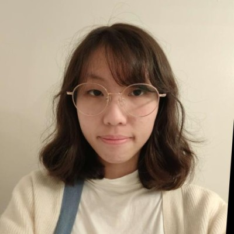
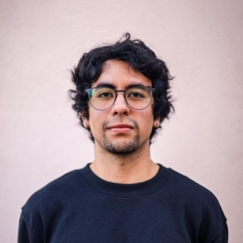

# About Us

  
  

    
    
<b>Haotian Zhu</b>

    
 <a href="https://www.linkedin.com/in/haotian-zhu-12a1592b7/">LinkedIn</a>

    
<a href="https://github.com/zhtdbb1">GitHub</a>

  

  

    
    
<b>Ammie Xie</b>

    
<a href="https://www.linkedin.com/in/ammie-x-188210246">LinkedIn</a>

    
<a href="https://github.com/axie0927">GitHub</a>

  

## Acknowledgements

  
  

    
    
<b>Aobo Li </b>

    
📍Mentor 

    
 <a href="https://www.linkedin.com/in/aobo-li-9a0b15a7/">LinkedIn</a>

  

  

    
    
<b>Matthew Segovia</b>

    
📍Analysis Coordinator

    
<a href="https://www.linkedin.com/in/matthew-segovia-0b8702267/">LinkedIn</a>

  

{: .note-title }
> Special Thanks
>
> Special thanks to the members of [classification group](),our TA [Amitash Nanda], professor [Umesh Bellur] and all the UCSD faculties who taught and supported us!

----
[Amitash Nanda]: https://www.linkedin.com/in/amitash01/
[Umesh Bellur]: https://www.linkedin.com/in/umesh-bellur-7a77254/
