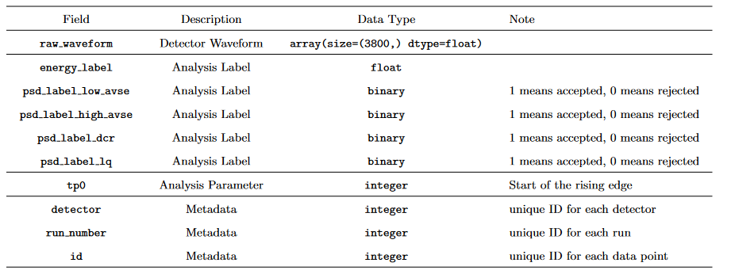

# Data

The processed train, test and NPML datasets contain 1.69M, 300k and 150k observations respectively. Each raw waveform data is feature engineered to extract parameters based on behaviors observed in the waveform.
The image below is the structure of our raw dataset, `energy_label` is the variable we want to predict as the regression group. 

 

