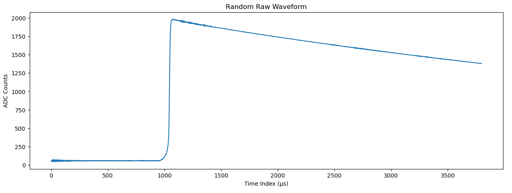
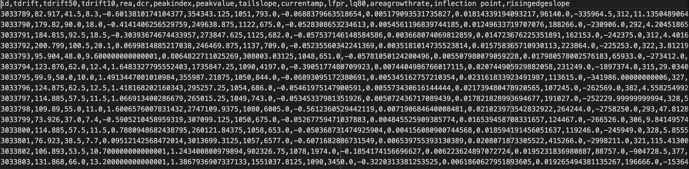

# Data Preprocessing
 
A total of 12 parameters were extracted from the waveform data to be trained in our model. These parameters could provide some insight on the various interactions between the variables.  Before calculating each parameter, the raw waveforms are normalized such that the ADC counts for each waveform all peak at the same value. Additionally, the noise that is present in the measurement of the raw waveforms are not included in this analysis.

All of the 12 parameters can be derived from a single waveform using principles of calculus and statistical analysis.

{: .warning}
Dozens of rows with missing values in the processed datasets are removed since neutrino data is sensitive and cannot simply be imputed.

