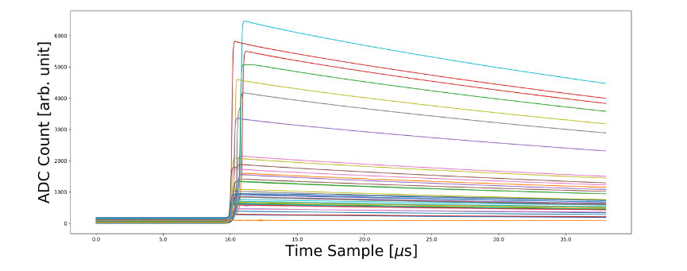

# Finding Ghost Particles
{: .fs-9 }
Advancing energy regression in neutrino research through machine learning-driven waveform analysis.
{: .fs-6 .fw-300 }


[Get started now](#getting-started){: .btn .btn-green .fs-5 .mb-4 .mb-md-0 .mr-2 }
[View it on GitHub][Our repo]{: .btn .btn-purple .fs-5 .mb-4 .mb-md-0 .mr-2 }
[Our report][report]{: .btn .btn-primaruy .fs-5 .mb-4 .mb-md-0 }

{: .note }
> The purple button above links to our project repo, click [here] or the link at the top right corner of this page to see the repo for this website.

---
## Introduction

Our Applied Data Science project in **NPML(Neutrino Physics Data Science)** applies machine learning to analyze time-series [waveform data] from the Majorana Demonstrator to detect energies in neutrinoless double beta decay by extracting key features and building ML/DL models. This could explain the matter-antimatter asymmetry and their unique mass properties, but background interference complicates signal identification. By optimizing feature extraction and model selection, our research reinforces neutrino detection precision, advancing our understanding of fundamental particle physics.
<br>

{: .warning }
This website focuses on the regression of the NPML project. For details on classification, please visit the [classification group's website]().

## The Neutrino
They are subatomic particles with no electric charge and very little mass, subject to interactions via gravitational and weak nuclear forces -- Hard to directly probe.
<center></center>

The neutrinos are everywhere and naturally produced through nuclear reactions in the sun, supernovae explosions, radioactive decays, cosmic rays, etc. 
<center></center>


<br>
## Overview on data and parameters
This section gives our viewers a quick look on the [data](), [extracted parameters]() and our goal for this project. Please click the link or the sidebar on the left for more details.

[Interactive plot of parameters](#interactive-plot-for-parameters){: .btn .btn-green .fs-5 .mb-4 .mb-md-0 .mr-2 }


### Raw Waveform

The image below is an example of waveforms,there are millions of waveforms in our datasets, we can extract 12 unique features from each of the waveforms to use in our models. See the [parameters]() section under the data section in the sidebar for more details.
<center></center>
<br>

### Interactive plot for parameters
The interactive plot below allows you to explore different extracted parameters visually. Use the dropdown menu to switch between plots and observe how each parameter behaves in the waveform analysis. This visualization provides a intuition into the key features that drive our machine learning models in the NPML project.

{: .note }
Not all the parameters can be visualized.

<!-- Dropdown menu to select the image -->
<select id="imageSelector" onchange="updateImage()">
  <option value="assets/images/drift_time.png">Drift Time</option>
  <option value="assets/images/LQ80.png">LQ80 Area</option>
  <option value="assets/images/Area_Growth_Rate.png">Area Growth Rate</option>
  <option value="assets/images/Rising_Edge_Slope.png">Rising Edge Slope</option>
  <option value="assets/images/Rising_Edge_Asymmetry.png">Rising Edge Asymmetry</option>
  <option value="assets/images/Energy_Peak.png">Energy Peak</option>
  <option value="assets/images/Tail_Slope.png">Tail Slope</option>
  <option value="assets/images/Delayed_Charge_Recovery.png">Delayed Charge Recovery</option>
  <option value="assets/images/Fourier_Transformation_and_LFPR.png">Fourier Transformation and LFPR</option>
  <option value="assets/images/Current_amplitude.png">Current Amplitude</option>
</select>

<!-- Display the selected image -->


<!-- JavaScript to switch images based on selection -->
<script>
  function updateImage() {
    const selector = document.getElementById('imageSelector');
    const image = document.getElementById('displayImage');
    image.src = selector.value;
  }
</script>

## Getting started
### Step 1: Installation Instructions
How to clone the repository:
``` bash
git clone https://github.com/axie0927/FindingGhostParticles-RegressionSubgroup.git
```
{: .note}
> Make sure you have Anaconda installed for the next step.

### Step 2: Anaconda Environemnt Instructions
#### 1. Replace `name_of_environment` with a name you like:
``` bash
conda env create -f environment.yml --name name_of_environment
```
#### 2. Activate the environment:
``` bash
conda activate name_of_environment
```
### Step 3: Download the Proprocessed Dataset or Preprocess your own raw Data:
#### **Option 1: Download the preprocessed dataset(Recommended)**:
1. Download the preprocessed data from this [link](https://drive.google.com/drive/folders/1SnmQemcXWPvKvJBmGkd0hSqTQ8gbs0C4), place all the csv files in the 'Data' folder under `src/Models` before running the .py files.
2. (Optional): If you would like to use the notebooks located at `src/Models/Notebooks`, also place the files from the link above in the 'Data' folder under `src/Models/Notebooks`.


#### **Option 2: Proprocess your own data:**
There are 25 different data files, and this data is not processed. In order to extract parameters from the data, download the raw data and run the Master.py script located in the src folder of the repository. The src folder also contains a parameter-functions folder with each parameter extraction function separately defined. Due to the large size of the data files, the processed data will not be kept in this repository.
1. Download the raw data at this [link](https://zenodo.org/records/8257027).
2. Create a directory at `src/Parameter Extraction` and name it 'data', place all the raw data in it.
3. Run the code below in your terminal:
``` bash
cd src/Parameter\ Extraction
```
``` bash
python3 Master.py
```
4. Place all the generated csv files in the 'Data' folder under `src/Models` before running the .py files.
5. (Optional): If you would like to use the notebooks located at `src/Models/Notebooks`, also place the files from the link above in the 'Data' folder under `src/Models/Notebooks`.

### Step 4: Apply the models on the processed dataset:
> **⚠️ Warning:** Make sure there are 4 files in the data folder -- `MJD_NPML_PCOCESSED.csv`,`MJD_TEST_PCOCESSED.csv`, `MJD_Train_PCOCESSED.csv`,`npml_cut.csv`. Where `npml_cut.csv` is the predictions of classification group.
> 
> **❗ Important:** `DeepLearning_NN.py` is our best final Model,not only it is applied on test set but also generates the predictions on NPML dataset which is the real world data without known true value, the others are applied only on test set for reference.
#### 1. Move to the Models directory:
``` bash
cd src/Models
```
#### 2. Replace `the_model_you_like.py` with the true model name:
``` bash
python3 the_model_you_like.py
```
After finishing the step above, please see your terminal for the results and guides 😉


----

[Our repo]: https://github.com/axie0927/FindingGhostParticles-RegressionSubgroup
[report]: https://github.com/axie0927/artifact-directory/blob/main/report.pdf
[here]: https://github.com/zhtdbb1/FindingGhostParticles-Website
[waveform data]: https://zenodo.org/records/8257027
