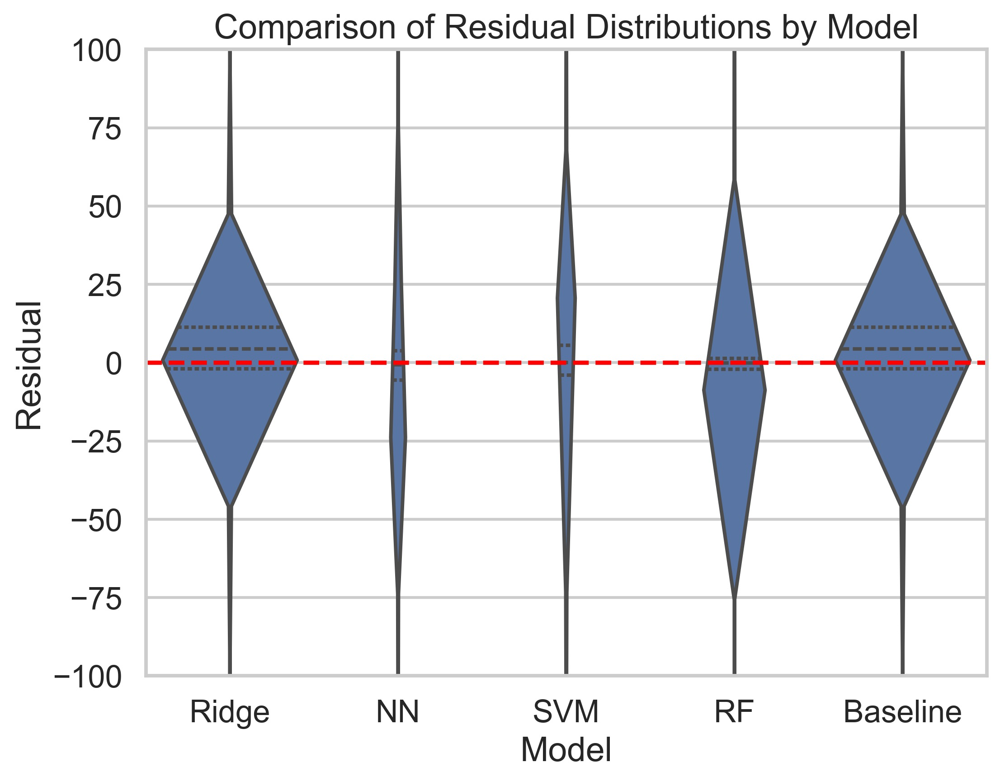
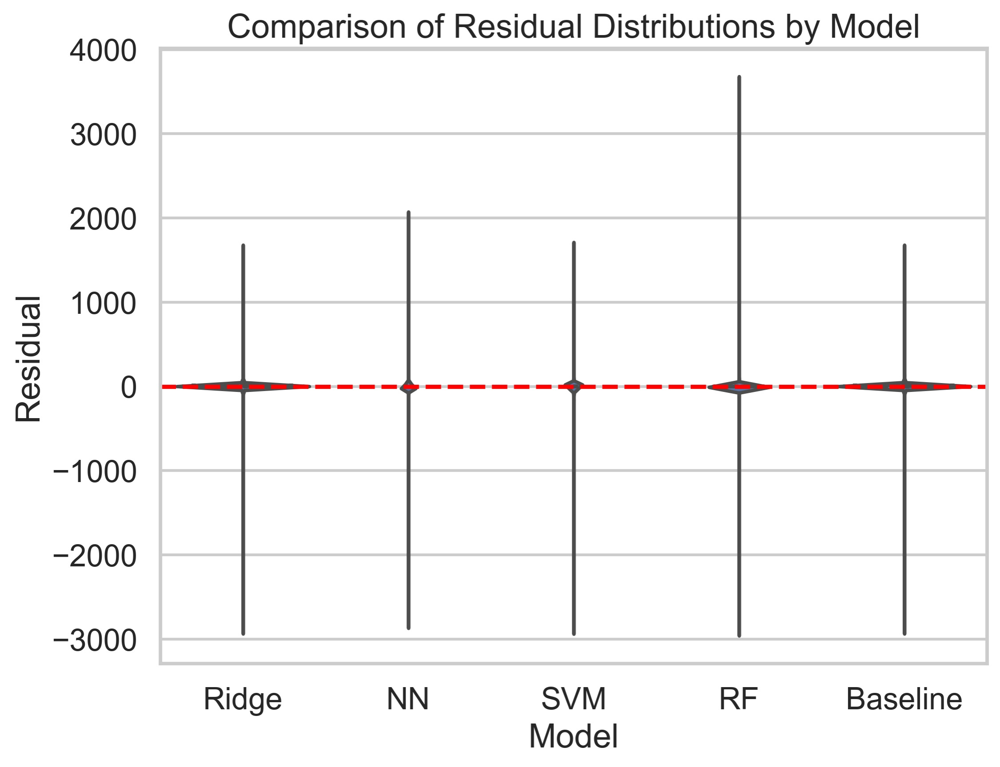

# Models

## Overview
- [Linear Regression (**Baseline Model**)](/regression#Linear-Regression-Baseline-Model)
- [Ridge Regression](/regression#Ridge-Regression)
- [Support Vector Machine Regression](/regression#Support-Vector-Machine-Regressor)
- [Random Forest Regression](/regression#Random-Forest-Regressor)
- [Neural Network (**Best final model**)](/regression#neural-networks)

## Performace

| Model           | MSE               |Probability Mass of Residuals(-75 to + 75 )|
|:----------------|:------------------|:---------------|
|Linear Regression| 4706.4220         |0.9796        |        
|Ridge Regression | 4706.4220         |0.9796        |
|SVR              | 4759.4116         |0.9774        |
|RF Regression    | 1860.8112         |0.9878        |
|Neural Networks  | 1507.1353         |0.9896        |

Image below is a violin plot with a y-axis ranging from -75 to +75 that shows the distribution of residuals among the models we used: Neural Network (NN), Random Forest (RF), a Baseline Model, Support Vector Machine (SVM), and Ridge Regression. If we only look at the zoomed figure along with the probability mass table, RF and SVM have relatively slenderer violins around zero whereas NN has the best residual distribution and a higher probability mass between +75 and - 75, meaning they might have better predictive accuracy. Whereas the others appear narrower than NN so they have moderate-value residuals distributed. However, a distribution with narrower center could also indicate under-fitting, where the model doesn’t perform well to capture the true variability in the data , but we can rule out this assumption since all the models have desired R2 scores that are above 95%.  

 

 

Most importantly, by comparing the two plots and the table at once, we can observe that although NN has a relatively  similar range of residuals compared to the others(and RF has an even larger one), the probability mass table shows that only a small portion of the residuals are outliers. Despite ridge and baseline looks better than RF in the zoomed plot, we also need to consider the residuals outside of  +75 and -75 which is hard to see but well explained by the probability mass table. Therefore, in terms of variance explained, consistency and MSE, NN will be our best overall model.