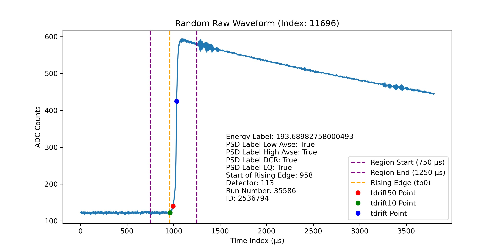

# Parameters

## Drift Time
In a germanium detector, ionizing radiation generates electron-hole pairs within the detector material. The movement of these charge carriers across the detector toward the electrodes generates
a detectable signal. The drift time (tdrift) is defined as the time taken from the initiation of charge
generation to the collection at the detector’s point contact. This drift time correlates with the location of the event inside the detector, as interactions that occur further from the point contact result
in longer drift times due to the greater distance the charge must travel.
Drift time is extracted from tp0 (given in the dataset) to 99.9% of the peak value. It is typically
obtained by interpolating the rising edge of the waveform, allowing for a more accurate measurement, as the resolution of the waveform is often limited by the number of data points in a given time
window.

## Late Charge (lq80)
The LQ80 Parameter is used to measure the amount of energy being collected after 80% of the
peak. This is important because multi-site events have extra energy collections that appear in this
LQ80 region. In order to extract useful information from our Late Charge parameter we can see the
behavior of our late charge in our multi-site versus single-site events. In our multi-site events there
is an extra energy collection which causes another spike in our LQ80. This phenomenon is not seen
in our single-site events.

## Late Charge Slope (Area Growth Rate)
Using the Growth rate we can see how our multi-site even grows compared to our single site event.
To capture this relationship, there was an area created that approximated peak energy from 80%
of the charge and subtracted the actual area from 80% of the charge to the peak. This method was
done using a summation of the energy points instead of fitting a line in order to keep the small
changes in energy present in our growth rate.

## Second derivative Inflection Points 
The next parameter, our Second Derivative inflection points, finds the amount of inflection points
from 80% of our charge to the peak. This is because multi-site events have more concavity changes
than single-site events. This was done by using NumPy gradient twice to find the second derivative,
and then using NumPy sign and diff and filtering to the elements that had 2 and -2 which would be
points where our gradient changed from positive to negative and vice versa.

## Rising Edge Slope
The Rising Edge slope parameter is a way for us to measure the slope of the charge that was recorded.
This is important because in our multi-site events there is an extra charge being deposited. This
would mean that our slope would be lower in our multi-site events and due to this we can calculate
the slope from our initial charge to the peak and use it as a parameter for our model. We can carry
this out by fitting a line through linear regression to our rising edge and calculating the slope.

## Rising Edge Asymmetry 
The rising edge asymmetry parameter describes how tilted in a direction the rising edge of the signal
is, or in other words how skewed the rising edge is. This is important because it can help distinguish between MSE and SSE. MSE will usually have a lower skew meaning it is more symmetrical
compared to SSE. When fitting to a MSE under-fitting can hide the extra bump and would make
the charge look like a SSE. Another thing to look out for when calculating rising edge asymmetry
is if the curve is distorted beyond being comparable to a half-Gaussian, a half-Gaussian curve will
have to be fit to be able to calculate the skewness. This can be dangerous since under-fitting or
over-fitting should be avoided.

## Current Amplitude
The current amplitude of a single waveform is the peak rate of charge collection, defined as I = dq/dt
which means current amplitude is the derivative of charge. The reason we need that parameter is
it helps distinguish between different types of events such as SSE and MSE in our particle detection
project, where SSE typically shows a higher amplitude as opposed to MSE.
Normalization is performed on the interpolated waveforms to eliminate energy dependence before
applying a sliding window derivative function. In many signal processing or particle detection applications, energy dependence can influence measured values, leading to inconsistencies in parameters
across events of different energies. Finalize the amplitude of a waveform by finding the maximum
value of that waveform’s derivatives.

## Energy Peak 
After the particle hits the detector, the energy reaches its peak. A dramatic spike is visible in the
energy graph. This is typically the maximum ADC count. The height of this peak correlates with the
energy deposited by the particle in the detector, which is why it’s used as a measure of the particle’s
energy.
The peak energy is extracted by locating the index of the maximum value in the waveform using the
np.argmax() function, which shows the highest amplitude reached by the signal.

## Tail Slope 
The tail slope is the rate of charge collection over the length of the waveform’s tail. It indicates how
quickly charge dissipates in the detector after the initial interaction. Events where charge deposition
occurs near the surface of the detector cause a delayed charge collection and result in a slower decay
rate within the tail, so the slope of the event is less negative. Before the slope is extracted, the
waveform has to be corrected for negative slope that could be induced by amplification circuits. The
tail slope is calculated by fitting a linear model to the final segment or the “tail” of the waveform,
giving us the slope which represents the decay rate of the signal. 

## Delayed Charge Recovery 
The DCR parameter helps to distinguish surface alpha background events by assessing the rate of
area growth in the tail slope region. It quantifies the arrival of charges that are delayed by one
nanosecond or more after the initial charge collection. Additionally, DCR is responsive to events
where charges become temporarily trapped in potential wells within the detector before being released. This parameter is extracted by calculating the area above the tail slope to the peak of the
waveform rise.

## Fourier Transform and Low Frequency Power Ratio 
The Fourier Transform is a mathematical operation that transforms a time-domain signal into its
frequency-domain representation. It decomposes a complex signal into a sum of sines and cosine
components at different frequencies. Fourier Transform is useful for distinguishing between single-site events (SSE) and multi-site events (MSE) within detector data because of the nature of charge
distribution within the detector, as most of the energy from the particle interaction in SSE is deposited
at a single point whereas it is deposited in multiple locations in MSE. For this experiment, the Fourier
transformed waveform is normalized to enhance the results.
To capture the differences between SSE and MSE, Low Frequency Power Ratio (LFPR) is used,
quantifying how much of the signal’s energy is concentrated in the low-frequency threshold by the
total power spectrum of the Fourier transformed waveform. This ratio provides a measure of the
waveform’s “smoothness”. SSE waveforms tend to have a higher concentration of energy at lower
frequencies because their energy distribution is concentrated at lower frequencies, resulting in high
LFPR. In contrast, MSE waveforms have a more complex distribution of energy from interactions at
multiple sites. This broader distribution leads to a lower LFPR.

