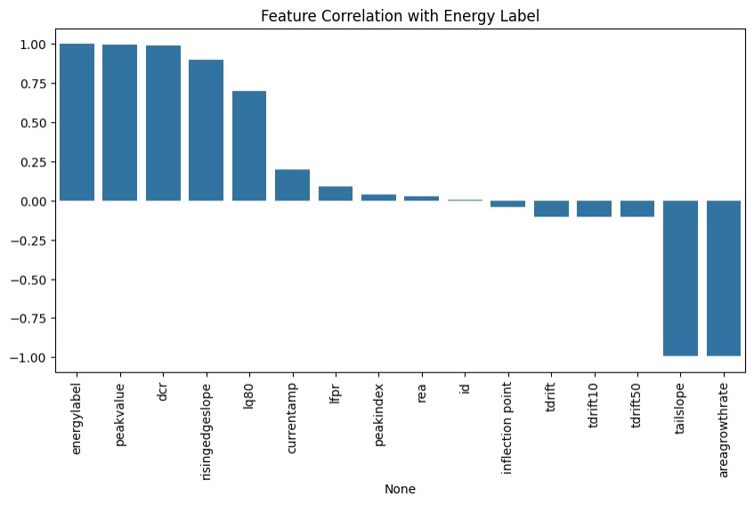
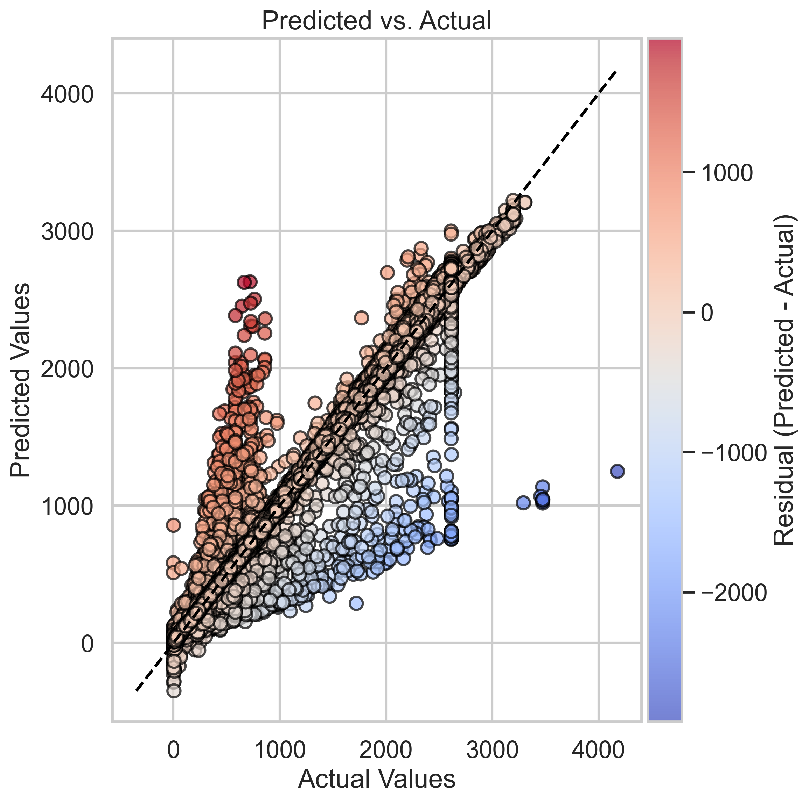
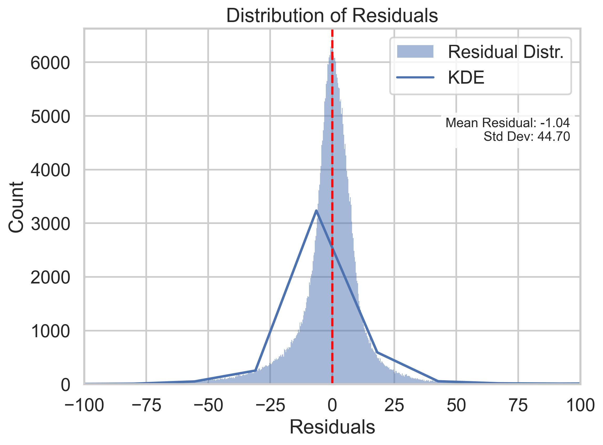
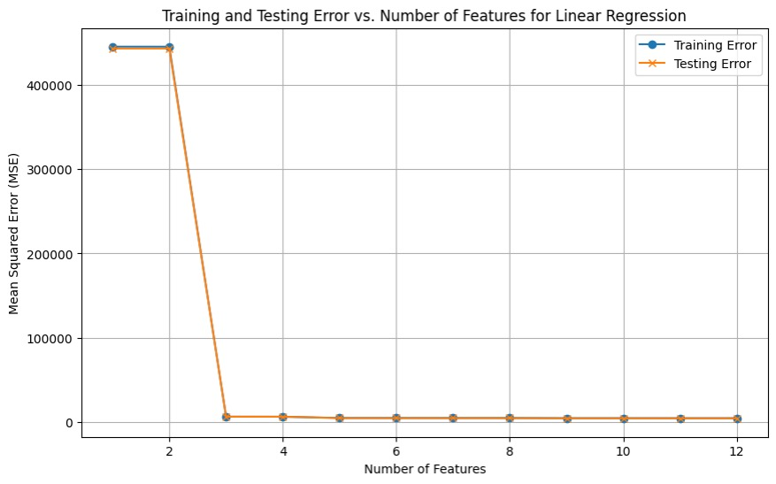
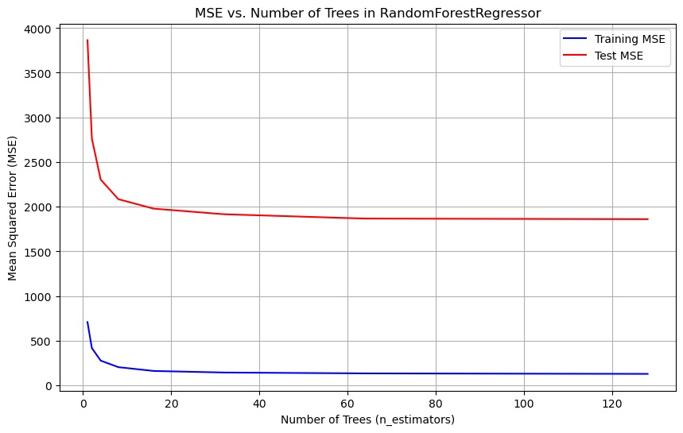

# Regression Group
## EDA
To begin our investigation of regression models, we first performed an exploratory data analysis on
the processed dataset. This analysis involved examining the distributions of the independent variables and the target variable to gain a deeper understanding of the processed data. The target variable, Energy Label, is a continuous measure representing the energy level of individual waveforms
in kiloelectronvolts (keV). Through our analysis, we identified strong linear relationships between
specific parameters and the Energy Label. Based on this finding, we determined that a simple linear
regression model would be the most appropriate choice for our baseline model.
<center> </center>


## Neural Networks

{: .important}
This Model is our best overall model and we used it to predict the NPML dataset. You can find the predicted energy spectrum in the [conclusion section]()

<div style="display: flex; align-items: flex-start;">
  
  <p style="margin-left: 15px;">The final model trained and evaluated was a Neural Network with three hidden layers: input -> 64 -> 32 -> 16 -> output, implemented using the PyTorch. The Rectified Linear Unit (ReLU) activation function was selected for the neural network due to its versatility and computational efficiency. Image on the left is the operation architechture of our NN model. It is crucial to note that null values were explicitly excluded from this analysis, as their presence could compromise the integrity of the algorithm and ruin the whole NN model. <br><br>
  Due to computational constraints, the number of epochs was limited to 30 in an optimal setting, increasing this to 100 would likely yield improved performance. However, since an early stopping was implemented to mitigate overfitting, so it often stops around 20 epochs.</p>
</div>

### Code Snippet
This code snippet only contains the architechture and part of main function in our .py file, please check the .py file out for more information such as standardization and tensor conversion.

Architechture:
{: .label .label-green }
``` python
class NPDL(Dataset): # Neutrino Physics Deep Learning
    def __init__(self,X,y):
        self.X = X
        self.y = y
    
    def __len__(self):
        return len(self.X)
    
    def __getitem__(self,idx):
        return self.X[idx], self.y[idx]

class SuperPredictor(nn.Module):
    def __init__(self, input_size):
        super(SuperPredictor, self).__init__()
        self.fc1 = nn.Linear(input_size, 64)
        self.fc2 = nn.Linear(64, 32)
        self.fc3 = nn.Linear(32, 16)  
        self.out = nn.Linear(16, 1)
        
        self.relu = nn.ReLU()
        self.dropout1 = nn.Dropout(0.3)  
        self.dropout2 = nn.Dropout(0.4)  


    def forward(self, x):
        x = self.relu(self.fc1(x))
        #x = self.dropout1(x)  # can't use this since neutrino physics data is very sensitive
        x = self.relu(self.fc2(x))
        #x = self.dropout2(x)  # we might accidently drop critical signals
        x = self.relu(self.fc3(x))
        x = self.out(x)
        return x

```
Main:
{: .label .label-blue }
``` python
    model = SuperPredictor(input_size).to(device)
    criterion = nn.MSELoss()
    optimizer = torch.optim.Adam(model.parameters(), lr=0.0008)

    num_epochs = 30
    best_loss = float('inf')
    patience = 5  # Stop training if no improvement after 5 epochs
    counter = 0
    
    for epoch in range(num_epochs):
        model.train()
        running_loss = 0.0
    
        for X_batch, y_batch in train_loader:
            optimizer.zero_grad()
            outputs = model(X_batch)
            loss = criterion(outputs, y_batch)
            loss.backward()
            optimizer.step()

            running_loss += loss.item() * X_batch.size(0)
```
### Performance
<div style="display: flex; justify-content: center; gap: 10px;">
    
    
    
</div>

As we can see here, the wide-spreading residual points in the left plot indicate that Neural Networks cannot predict some of the points well at specific actual energy values. One of the reasons might be that we are not able to know the true dependent labels in the test set that can only be predicted by classification. Which could result in absences of information about background noise and such physics phenomena that could change the true energy(dependent variable). However, although the Predicted vs Actual graph of the Neural Networks model might seem worse than the one of the Random Forest Regressor, the overall performance of the Neural Networks model still has the lowest MSE among all the models.

{: .note}
Navigate to [Methods section]() to see the analysis and comparison of error metrics for each model. 

## Linear Regression (Baseline Model)
The baseline model was trained using 5-fold cross-validation to enhance its generalizability across different datasets. This technique helps mitigate overfitting and ensures that the model performs well on unseen data. By minimizing MSE, the model prioritizes accuracy in predicting energy levels, making it a reliable measure of performance. The baseline model achieved an MSE of 4706.4220. Although interpreting MSE in isolation can be challenging, it serves as a benchmark for comparison against more complex models, with the objective of achieving a lower MSE. To determine the optimal number of training parameters, the baseline model was evaluated using a loop that tested parameter counts ranging from 1 to 12. The results indicated that the lowest MSE was obtained when all 12 parameters were utilized, suggesting that incorporating the full set of features improves model performance.
<center> </center>

## Ridge Regression 
This model closely resembles linear regression, but includes a regularization term to enhance robustness and prevent overfitting. To optimize model performance, grid search was employed to perform cross-validation and hyper-parameter tuning. The best performing regularizer, which minimized the MSE, was determined to be 1e-05. However, despite this optimization, the lowest achieved MSE remained identical to that of the baseline model, indicating that Ridge regression did not provide an improvement in predictive performance.

## Support Vector Machine Regressor
SVR is inherently more complex than the the baseline and ridge models. However, after conducting cross-validation and hyperparameter tuning, the resulting MSE was 4759.4716, exceeding that of the baseline model. This outcome suggests potential overfitting, indicating that the SVM model may not be well suited for our predictive task.
We used Linear SVR instead of Non-linear methods like RBF due to the curse of dimensionality. Methods such as RBF kernalize the features tremendously increase the runtime of SVR on the training set that has millions of observations.

``` python
def train_svm_model(X_train, y_train):
    """Trains an SVM Regressor with hyperparameter tuning."""
    param_grid = {
        'C': [0.1, 1, 10],
        'epsilon': [0.1, 0.5], 
        'loss': ['epsilon_insensitive'],
        'dual': [True]  
    }

    svr = LinearSVR(max_iter=1000)

    # Perform GridSearchCV with 3-fold Crossvalidation (to minimize runtime)
    grid_search = GridSearchCV(
        estimator=svr,
        param_grid=param_grid,
        scoring='neg_mean_squared_error',
        cv=3,  
        n_jobs=-1,
        verbose=2
    )

    grid_search.fit(X_train, y_train)

    best_params = grid_search.best_params_
    best_svr_model = grid_search.best_estimator_

    return best_svr_model, best_params
```

## Random Forest Regressor

Furthermore, the data set was trained using a random forest regression model, a robust model known for its resilience to overfitting, a challenge encountered with the SVM model. Additionally, Random Forest models exhibit versatility and adaptability to various types of relationships within the data. After optimizing for minimal MSE, the model achieved an MSE of 1860.8112, marking a substantial improvement over previous models. Hyper-parameter tuning primarily focused on adjusting the number of trees in the model. Figure 25 illustrates the training and testing MSE across different tree counts, demonstrating that increasing the number of trees leads to a reduction in MSE. The optimal number of trees, resulting in the MSE mentioned above, was determined to be 128.
<center> </center>
